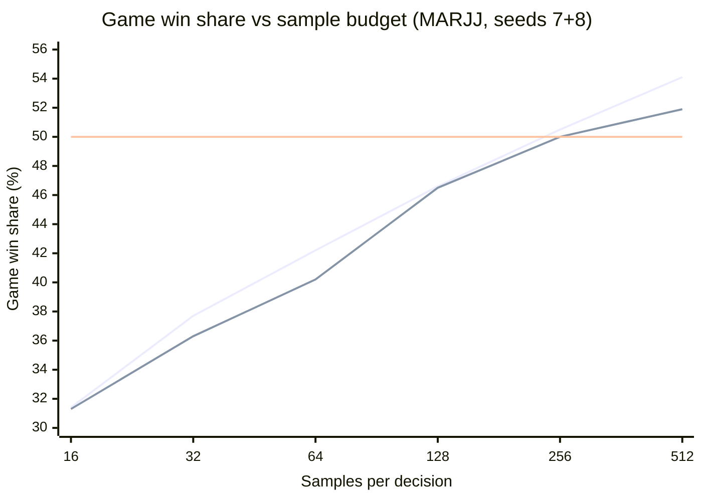

# Reaching strength parity with MARJJ

Written 2026-08-09 against the completed fixed strong-opponent panel
([report](strong-opponents.md), [raw JSON](strong-opponents.json)).
The companion [design document](marjj-parity-design.md) carries the
technical designs this plan schedules.  The M2.5 diagnostic evidence is
retained separately as [aggregate JSON](marjj-m2.5-diagnostic.json), and
M5's as the two raw arena legs it compared,
[table](marjj-m5-table-arm.json) and [affine](marjj-m5-affine-arm.json).
M6 retains the [MARJJ arm](marjj-m6-mc256-arm.json) and its
[EAAI](marjj-m6-mc256-eaai-guard.json) and
[Gold](marjj-m6-mc256-gold-guard.json) guards.  The follow-up full
sample-budget curve is retained as a
[raw arena bundle](marjj-sample-curve.json), and its paper-profile repeat
as a [second bundle](marjj-sample-curve-20-0.9-6.json).  The later public
file's constants are compared with the paper-reported profile in retained
[`20/0.9/7`](marjj-profile-20-0.9-7.json) and
[`20/0.9/6`](marjj-profile-20-0.9-6.json) diagnostic arms.

Throughout, "MARJJ" means `marjj-v5-surrogate`: the host-engine
reconstruction of the later public MARJJ v5 file, measured under the
corrected EAAI protocol.  The surrogate is associated with the 2021
challenge winner but is not established as the championship binary; the
target of this plan is the surrogate itself, which is the strongest
opponent this engine can actually be measured against.

**Status as of 2026-08-18: sample budget closes the measured gap.**  At
diagnostic counts, `mc:256` reached 51.2% against MARJJ with the lower
confidence bound above 50%, cleared both guard opponents, and cost 1.99×
the hard-decision latency of `mc:128`.  A follow-up curve places
`mc:512` at 54.1% (52.6–55.5%), with both seeds above 50%.  The current
default and fixed panels remain `mc:128`; promoting a larger sample
budget is a separate default and publication decision.  M3 remains
blocked, and the three modeled diagnoses tested in M1, M2, and M5 remain
refuted.

## 1. Goal

Bring the **default-configuration** `mc:128` to statistical parity with
`marjj-v5-surrogate` over whole games, without giving back strength
anywhere else.  A bespoke anti-MARJJ build would be overfitting theater;
the deliverable is a shipped default that handles gin-campers because it
understands opponents, not because it memorized this one.

Operational definition, using the panel's own protocol (`--rules eaai
--alternate-dealer`, mirrored pairs, seeds 7 and 8, 3000 game pairs per
seed, pair-cluster intervals, exact pair-sweep sign test):

- **Parity reached**: pooled game win share ≥ 50% with the 95%
  pair-cluster lower bound ≥ 48%, both seeds agreeing in direction.
- **Stretch**: lower bound ≥ 50% — strictly stronger, not merely level.

Guards that must hold in the same measurement cycle before any default
changes (all are non-inferiority bounds, two points under the current
panel figures):

- vs `EaaiSimpleBot`, games: `mc:128` ≥ 67.2% (now 69.2%).
- vs `gold-paper`, games: `mc:128` ≥ 72.5% (now 74.5%).
- `tests/strength.rs` keeps the greedy game floor at 55% and raises the
  default Monte Carlo game floor to 60.9%, seven points under its current
  fixed fixture.
- Mean serial decision latency at defaults stays within ~2× the current
  ~10 ms average turn (`cargo bench`); analysis configs may exceed it,
  the interactive default may not.

## 2. Where we stand

From the fixed panel, candidate game win share against MARJJ:

| Candidate | Games won | Points/round | K/U/G (candidate) | K/U/G (MARJJ) |
|-----------|----------:|-------------:|------------------:|--------------:|
| `greedy`  | 29.2% (28.4–30.0%) | 7.87 vs 14.43 | 6678/32/1850 | 1310/2627/3402 |
| `mc:64`   | 42.4% (41.6–43.2%) | 12.60 vs 14.41 | 4219/13/4014 | 1380/1927/3913 |
| `mc:128`  | 46.7% (45.9–47.5%) | 13.48 vs 14.24 | 3670/17/4559 | 1394/1466/4252 |

The patient default has narrowed the problem: `mc:128` wins **53.7% of
decisive rounds** yet 46.7% of games, and trails by only 0.76 points per
round.  It now out-gins MARJJ 4559 to 4252, but MARJJ still undercuts it
1466 times while being undercut only 17 times.

## 3. Original diagnosis — now refuted

The following was the hypothesis that scheduled M1 and M2, not the current
explanation.  Both interventions later contradicted it: modeling a camper's
knock policy hurt in M1, and modeling a developed hand hurt in M2.  M2.5
below records what actually changes when the latter is enabled.  Every
count in this section was measured against the pre-M1 default, which
knocked at the first legal chance in its own rollouts; §2's table is the
current one.

MARJJ v5's policy, from the surrogate: take the upcard only when it
lands in a meld and lowers deadwood; discard by minimizing `deadwood +
18 · 0.9^(turn−1) · one-ply-draw-lookahead + danger`; **knock
voluntarily only on turns 1–3**, then play exclusively for gin; choose
the knock spread that minimizes the opponent's layoff.

Our Monte Carlo rollouts model the opposite opponent.  Both rollout
seats knock at the first legal chance (`rollout_knock_self` and
`rollout_knock_opponent` default to `u8::MAX`), and sampled opponent
hands are the best of `pile_len / 2` uniform draws — far weaker, deep
into a round, than a camper who has been assembling melds for ten
turns.  Two systematic errors follow:

1. **Undercuts look impossible.**  In the sampled worlds the opponent's
   deadwood is high, so knocking at 8–10 rates as safe.  In reality
   MARJJ is sitting on a near-gin hand: 3758 of our 11 889 knock
   attempts — **32%** — were undercut at −25 and change apiece.
2. **Gin-hunting looks suicidal.**  The modeled opponent knocks next
   turn in every rollout, so patient lines score terribly and the bot
   knocks instead.  Against an opponent who will never knock, holding
   out is exactly right — MARJJ out-gins `mc:128` 1556 to 1002, and
   out-gins even our gin-leaning `greedy` 3402 to 1850.

The proposed common root was the rollout's mismatched opponent model.  M1,
M2, and M2.5 retain this section as the hypothesis they tested rather than
as a conclusion.

## 4. The path

Phases are ordered by evidence-per-line-of-code: the first experiments
need no library changes at all, because the levers already exist —
`rollout_knock_opponent: 0` *is* a gin-camper model, and
`opponent_strength_percent` already scales hand plausibility.  Each
phase ends with a measured go/no-go against the surrogate (search on
seed 7, confirm on seed 8, per the `measure-strength` skill).

| Phase | Change | Code touched | Gate (win share vs MARJJ) |
|-------|--------|--------------|---------------------------|
| M0 | Point the sweep harness at the surrogate | `examples/tune.rs`, plus the docs it invalidates | Smoke run reproduces ~34% at the then-current default — *met* |
| M1 | Sweep existing `McConfig` knobs | none | Best fixed config ≥ ~42%, else re-diagnose |
| M2 | Calibrated opponent-hand sampling | `src/mc.rs` (+ baked curve) | Cumulative ≥ ~46% — *missed: −1.2 vs MARJJ, ships off* |
| M2.5 | Decompose default vs calibrated play by finish channel | benchmark-only example + aggregate JSON | Stable leading channel across seeds — *met: MARJJ gin losses* |
| M3 | Adaptive opponent-archetype inference (opt-in knob) | `src/mc.rs`, driver hook | *blocked pending a profitable archetype arm and redesign* |
| M4 | Flip the measured default; publish | defaults, panels, docs | Full `bench-strong.sh` + `bench-panel.sh` reruns — *executed for M1; M6's default decision is open* |
| M5 | Test the score-aware value function against MARJJ | none (`mca:128` already exists) | ≥ +2 points from `GameValue::Affine` — *missed: −0.3, mechanism inert* |
| M6 | Double the sample budget and check latency/guards | none | ≥ +2 points, both seeds agreeing — *met: +4.3, diagnostic stretch* |

**M0 — harness (design §D1).**  `tune` gains `--opponent
marjj-v5-surrogate` and `--opponent gold-paper`, and — the part §D1
originally missed — `--alternate-dealer`, without which every sweep runs
under winner-deals-next and selects arms against a different Monte Carlo
value table than the panel measures.  The surrogate stays frozen and
outside the library API.  Half a day.

*Gate met.*  At 2000 unpaired games on seed 7 under `--rules eaai
--alternate-dealer`, default `mc:128` won 34.4% (Wilson 32.3–36.5%)
against `marjj-v5-surrogate`, reproducing the panel's 34.2%; the same
command against `eaai` returned 59.0% (56.8–61.1%) against the baseline
panel's 59.9%, which isolates the new dealer loop from the new opponent.
`tune`'s unflagged path is byte-identical to its pre-change output.

**M1 — the free experiments (design §D2).**  Sweep, against MARJJ over
paired whole games under `--rules eaai --alternate-dealer`:
`--opp-knock {255, 0}`, `--rollout-knock {255, 2, 0}`,
`--opp-model {eager, meld}`, `--opp-strength {100, 200, 400}`,
`--max-candidates {4, 6, 8}`; secondarily a `greedy` lane over
`(knock_threshold, score_awareness)`.  Hypothesis: camper
knock model plus stronger sampled hands recovers a large slice of the
gap by itself.  Compute-bound (a day or two of wall clock), zero risk,
and it localizes how much gap remains for real designs.

*Gate met, hypothesis refuted.*  At 2000 games per arm on seed 7, the
causal core ranked by the bot's *own* rollout continuation, not by the
modeled opponent's: `rollout_knock_self: 0` won 46.0% (Wilson
43.8–48.1%), `2` won 39.0%, and today's `255` won 34.4%.  Modeling the
opponent as a camper *hurt* — `rollout_knock_opponent: 0` cost about
three points at every self value (31.9/31.2/30.8%).  Refining around
the winner, `opponent_strength_percent: 200` added ~2 points (48.0%,
45.8–50.2%) with 400 no better (47.5%), `max_candidates` measured flat
(6: 45.1%, 8: 46.4%), and `OpponentModel::MeldOnly` lost 2.8 points
(43.2%), reconfirming §6 now that it is paired with a patient self
policy.  Seed 8 confirmed the best arm at 47.7% (45.5–49.9%).  The
secondary `greedy` lane peaked at 29.6% (knock 4, awareness 32) against
the panel's 29.2% default, so no fixed policy closes the gap and the
whole remedy lives in the search.

So §3's diagnosis was half right: the sampled opponent's *hand
strength* is the defect, and the camper knock rule is not — a rollout
opponent who never knocks makes every line look safe and trades the
undercut error for a passivity error.  That raises M2's importance and
lowers M3's: calibrated sampling is now the load-bearing change, while
archetype inference over *knock policy* has no measured value yet.  The
`opp_strength` probe bounds what crude hand inflation buys at roughly
two points, which is M2's headroom to beat.

The same arm also beats today's default *everywhere else*, measured
identically at 2000 games on seed 7: 71.3% vs `EaaiSimpleBot` against
the default arm's 59.0%, and 76.5% vs `gold-paper` against 67.2%.  This
is a general strength gain, not an anti-MARJJ exploit, and it is
therefore a candidate default change — which by house rule needs the
full panels (`bench-strong.sh`, `bench-panel.sh`) and a `cargo bench`
latency check, since `rollout_knock_self: 0` lengthens every rollout.
Promoting it is M4 work arriving early; nothing ships on `tune`
evidence alone.

**M2 — calibrated sampling (design §D3).**  Replace best-of-k-uniform
with sampling toward baked deadwood-by-turn curves measured from
archetype self-play, so a sampled world's opponent is as developed as a
real one at that point in the round.  This is what prices undercut risk
correctly, and the same instrumentation yields the knock-hazard curves
M3 needs.

*Gate missed against the target; the change is real but points the other
way.*  Two findings, in order.  First, the gap is twice what §3 assumed —
at a twelve-card pile best-of-k models the opponent at 28 deadwood where
a hand played since the deal carries 13 — and §D3's *selection* toward a
target cannot close any of it, because the minimum of k draws already is
the closest draw to any target below it.  Sampling has to construct a
developed hand, which `MonteCarloBot::develop` does; sampled worlds now
land at 13.0 ± 2.  Second, having done so: against `marjj-v5-surrogate`
calibration measured **−1.2 points** of game win share (48.2% against
47.0% over 8000 games a side, pooled over seeds 7, 8 and 9; the
per-seed deltas were +0.2, −1.5 and −1.9, the largest sample the most
negative), while gaining **+3.2** against `EaaiSimpleBot` (69.1% to
72.3%) and **+2.0** against `gold-paper` (75.2% to 77.2%), both seeds
agreeing in direction.  Latency cost is 2.5% at 128 samples.

So a realistic opponent hand is worth two to three points against
opponents who knock, and costs about one against the camper this plan
targets — the exact opposite of §3's undercut diagnosis, which predicted
calibration would pay off *most* against MARJJ.  `hand_calibration`
therefore ships default off: the goal is parity with MARJJ without
giving back strength elsewhere, and this trades the target for the
guards.  It is a documented option for general play, not a step toward
parity.

That leaves the parity gap unexplained by this plan's model of it.  Both
halves of §3's diagnosis have now been measured and both are wrong: the
camper knock model hurt (M1) and the calibrated hand hurts (M2), yet
patience alone reached 48%.  Before M3 builds inference over exactly
those two axes, the next step should be a diagnostic pass over the
rounds we lose — what actually decides them — rather than more
machinery aimed at a diagnosis that has twice failed to hold.

**M2.5 — finish-channel diagnostic.**  A dedicated benchmark observer
replayed the default and `hand_calibration: true` `mc:128` arms against
MARJJ for 2000 mirrored game pairs per arm on each of seeds 7 and 8.  It
used the exact EAAI rules and scored-round dealer alternation, common
random numbers across arms, and inspected hidden hands only outside the
strategies around normal `Table::step` calls.  The run is diagnostic, not
a replacement for the fixed panel.

The default arm won 47.7% (46.6–48.7%) of 8000 games; calibration won
47.0% (46.0–48.0%).  The paired delta was -0.69 points of game win share
(95% pair-cluster interval -2.02 to +0.64; exact arm-sign p = .161), with
seed deltas +0.4 and -1.8.  This alone reconfirms the negative pooled
direction without promoting it to a new strength claim.  Raw score margin
moved from -6.21 to -7.82 points/game, a -1.61 delta (-3.44 to +0.21).

The point accounting supplies the diagnosis.  Calibration made 7146
non-gin knock attempts where default made 17 770 and cut their undercut
rate from 29.2% to 19.3%.  Avoided undercuts recovered 13.71 points/game,
but forfeited knock wins cost 12.23.  It gained 10.90 points/game through
2842 additional own gins while losing 14.47 through 3897 additional MARJJ
gins.  Those MARJJ gin losses were the largest channel on both seeds
(-13.88 and -15.07 points/game), satisfying M2.5's predeclared stability
gate.  The same shift raised rounds with a declined legal knock from
21 849 to 31 034 and dead hands from 1800 to 3982.

So calibration does price undercut risk: it sharply reduces both attempts
and failures.  It loses because it over-corrects into patience, replacing
profitable knocks with longer gin races whose extra losses outweigh both
the saved undercuts and extra own gins.  The M3 design still has no
profitable camper leaf to infer toward, so M3 remains blocked pending a
separate redesign that preserves undercut selectivity without wholesale
passivity.

**M3 — adaptive archetype inference (design §D4, §D5).**  The bot
tracks, across the rounds of a game, when the opponent knocks and how
they draw; classifies them over a small archetype set (eager / balanced
/ camper); and samples worlds from the posterior mixture with each
archetype's rollout policy and hand calibration.  Ships behind a new
`McConfig` knob, default off, so the measurement compares like with
like.  A fresh game starts at today's behavior and converges within a
round or two of evidence — campers reveal themselves fast.  *Do not
implement this as written:* M2.5 found the calibrated camper branch
trades undercuts for a still larger gin-race loss, so classification has
no stronger MARJJ arm to select.

**M4 — ship it.**  Flip the knob's default in its own measured step
(a `McConfig` default change is a strength change by house rule),
re-run both fixed panels, regenerate the README tables from the
scripts, update `docs/strong-opponents.md`, CHANGELOG, and the
tripwire floors, then release per the `release` skill.

*Executed, but for the M1 arm rather than a parity arm.*  548339e set
`rollout_knock_self: 0` and `opponent_strength_percent: 200` as the
`McConfig` defaults; 9e117ff re-ran both fixed panels, regenerated the
README tables and `docs/strong-opponents.{md,json}`, and raised
`MONTE_CARLO_GAME_FLOOR` to 60.9%.  The §1 guard figures above are that
panel's.  At that point nothing remained to be done for MARJJ parity:
M2 shipped off and M3 never produced an arm to ship.  M6 later reopened
the campaign on the separate sample-budget axis.

**M5 — the score-aware value function, refuted.**  M2.5's
`by_starting_score` decomposition places 91% of the point deficit
against MARJJ in rounds the bot starts *ahead*: summed over finish
channels the default arm books −45 220 points while leading, −2 577
tied and −1 900 trailing, which is exactly its −49 697 raw margin
numerator.  The decisive round win share is flat to 0.1 pp across all
three states (54.40/54.43/54.32%); only the magnitude changes, from
22.82 points per round won while leading to 27.04 while trailing.  That
pattern implicates `GameValue::Table`, whose baked model is solved from
symmetric greedy self-play and is concave in the bot's own score, so it
should prefer a small knock to a gin exactly when ahead.  It is also the
one subsystem whose adoption evidence predates the dealer-rotation
correction — CHANGELOG records ~+0.45 points against `EaaiSimpleBot`
under the pre-correction protocol and flags that those figures need a
rerun.

*Gate missed; the mechanism is inert.*  The arena already ships the arm,
so the test cost no library lines: `mca:128` is `McConfig::new()` with
`game_value = GameValue::Affine`.  At 2000 mirrored game pairs per seed
on seeds 7 and 8 under `--rules eaai --alternate-dealer`, Affine won
46.6% of games (3727/8000) against a matched Table anchor's 46.9%
(3749/8000) — a **−0.3 point** delta, negative on both seeds (−0.4 and
−0.1).  The anchor reproduces the fixed panel's 46.7%, so the harness is
sound.  More telling than the null is that the *behavior* barely moved:
the bot's own K/U/G went 12 592/58/12 604 to 12 167/48/12 449, shifting
gin's share of its own wins by 0.6 points.  Removing score awareness
altogether does not change the knock-versus-gin tradeoff the
decomposition blamed it for.

So the leading-state concentration is mostly selection, not behavior.
The tell was available before the run and should have been read then:
MARJJ's *own* gin share swings from 49% to 63% between the same buckets
despite having no score term anywhere in its policy, so a common cause —
round length, and which games survive long enough to be observed from a
lead — explains both swings without any score-aware code.  The lesson
for whatever reopens this: an observational decomposition over a
scoreboard-conditioned bucket is confounded by game length, and the
cheap A/B is worth running before the mechanism is believed.

The guard legs against `EaaiSimpleBot` and `gold-paper` were deliberately
not run.  They only mattered had the MARJJ arm gained, and the open
question they would also have answered — whether `GameValue::Table` still
earns its default under the corrected protocol — is not a parity
question.  It stays open.

Both legs are retained verbatim as `gin-rummy-arena/v1` output:
[`marjj-m5-table-arm.json`](marjj-m5-table-arm.json) and
[`marjj-m5-affine-arm.json`](marjj-m5-affine-arm.json), each carrying its
own reproducibility block.  They are diagnostic, not panel-grade — 2000
pairs per seed against the panel's 3000, only two of the three opponents,
and `git_dirty` records the uncommitted edit to this document that was in
the tree when they ran.  Anything published from this axis needs
`bench-strong.sh` on a clean tree.

**M6 — sample-budget diagnostic (design §D6).**  The arena already
accepts `mc:256`, so this test added no bot code.  At 2000 mirrored game
pairs per seed under the corrected EAAI protocol, `mc:256` won 51.2%
(4094/8000, pair-cluster 50.1–52.2%) against MARJJ.  That is +4.3 points
over M5's matched `mc:128` anchor, with nearly identical gains on seeds
7 and 8 (+4.28 and +4.35).  The candidate led on both seeds (50.8% and
51.6%), and its pooled exact pair-sweep p-value against MARJJ was .027.
The diagnostic therefore clears both the predeclared +2-point gate and
the plan's stretch threshold at this count.  Search budget, rather than
another opponent-model mechanism, explains the residual gap.

The finish mix moved in the expected patient-search direction:
candidate knocks fell from 12 592 to 11 315, candidate gins rose from
12 604 to 13 726, and MARJJ undercuts fell from 5281 to 4151.  Raw score
was effectively tied at 82.37–82.38 points/game despite the candidate's
game edge, so the result is not a points-only artifact.

Both guards passed at the same counts.  `mc:256` won 73.1%
(72.2–74.0%) against `EaaiSimpleBot`, above the 67.2% floor, and 78.0%
(77.1–78.8%) against `gold-paper`, above the 72.5% floor; both seeds
agreed for both opponents.  The release strength tripwire also passed
before measurement.

On the hard first-discard Criterion position, 256 samples took 54.51 ms
against 27.38 ms for 128, or 1.99× — exactly at the approximate latency
ceiling.  Whole-game MARJJ throughput fell from the anchor's 5.48 to
1.81 games/s, so the larger budget is not a cheap default even though
the isolated decision benchmark stays inside the guard.  The default
therefore remains 128 here.  A request to promote a larger budget must
rerun the fixed publication panels on a clean tree.

The three clean-tree `gin-rummy-arena/v1` legs are retained as
[`marjj-m6-mc256-arm.json`](marjj-m6-mc256-arm.json),
[`marjj-m6-mc256-eaai-guard.json`](marjj-m6-mc256-eaai-guard.json), and
[`marjj-m6-mc256-gold-guard.json`](marjj-m6-mc256-gold-guard.json).
They are diagnostic rather than panel-grade: 2000 pairs per seed rather
than the publication panel's 3000.

**Full sample-budget curve — follow-up.**  An explicit request for the
analysis-only headroom extended M6 across every power of two from 16 to
512 samples.  Each arm played 1000 mirrored game pairs on each of seeds
7 and 8: 4000 games and 2000 independent pair clusters per budget.

| Candidate | Wins | Game win share (95% pair-cluster CI) | Seeds 7 / 8 | Raw margin/game | Games/s |
|-----------|-----:|-------------------------------------:|------------:|----------------:|--------:|
| `mc:16`  | 1255/4000 | 31.4% (30.0–32.7%) | 30.9% / 31.9% | -32.27 | 37.07 |
| `mc:32`  | 1506/4000 | 37.7% (36.2–39.1%) | 37.4% / 37.9% | -21.62 | 18.95 |
| `mc:64`  | 1686/4000 | 42.2% (40.7–43.6%) | 42.1% / 42.2% | -13.99 | 10.53 |
| `mc:128` | 1862/4000 | 46.6% (45.1–48.0%) | 45.3% / 47.8% |  -7.90 |  5.88 |
| `mc:256` | 2018/4000 | 50.5% (49.0–51.9%) | 50.3% / 50.6% |  -0.55 |  3.29 |
| `mc:512` | 2163/4000 | 54.1% (52.6–55.5%) | 53.9% / 54.3% |  +4.50 |  1.86 |

The curve crosses parity between 128 and 256 samples.  Its 256-sample
subset is directionally positive but inconclusive by itself (exact
pair-sweep p = .568); M6's larger retained run supplies the 51.2%
(50.1–52.2%, p = .027) evidence.  At 512 samples, both seeds, the raw
score margin, the pair-cluster interval, and the exact sweep test agree
on a candidate edge (p = 3.31e-8).  Throughput is machine-specific and
falls to 32% of `mc:128`, so this establishes analysis strength rather
than a cheap new default.  This curve is plotted alongside the
paper-profile repeat under the latter's table below.

The release tripwire ran first, then the six arena arms ran sequentially
without `--features parallel`:

```console
cargo test --release --test strength -- --ignored
for samples in 16 32 64 128 256 512; do
  cargo run --release --example arena -- --games 1000 \
    --p1 "mc:${samples}" --p2 marjj-v5-surrogate \
    --rules eaai --alternate-dealer --seeds 7,8 --format json \
    > "marjj-curve-mc${samples}.json"
done
jq -s . marjj-curve-mc{16,32,64,128,256,512}.json \
  > docs/marjj-sample-curve.json
```

The retained bundle contains the six complete
`gin-rummy-arena/v1` results with zero failures.  All record clean commit
`f28309b2cbf1c8c197e7a982374f0531101c03dc`, source SHA-256
`d0ebd3c4dcf9e6fcb22c720e3f31ba73e760b503c6c3d16bc62c7b6f288218fc`,
and Cargo lock SHA-256
`a0037359bca064781c6673725500d84f538f17c71ccd73478c8f84321f6d06d6`.
Mirrored games begin from common seeded shuffle streams and reverse
seats; orientation-dependent dead hands can still make later dealer
sequences diverge.

**Paper-profile sample-budget curve — follow-up.**  Repeating the curve
against the paper's `20/0.9/6` constants made the opponent modestly harder
at most sample budgets.  The protocol and counts match the source-profile
curve exactly.  Five arms were newly run; `mc:128` reuses the exact retained
paper-profile arm above because the measured source SHA-256 is identical.

| Candidate | Wins | Game win share (95% pair-cluster CI) | Seeds 7 / 8 | Raw margin/game | Games/s |
|-----------|-----:|-------------------------------------:|------------:|----------------:|--------:|
| `mc:16`  | 1250/4000 | 31.3% (29.9–32.6%) | 30.9% / 31.6% | -32.18 | 37.43 |
| `mc:32`  | 1452/4000 | 36.3% (34.9–37.7%) | 36.6% / 36.1% | -23.08 | 18.78 |
| `mc:64`  | 1606/4000 | 40.2% (38.7–41.6%) | 39.5% / 40.9% | -16.78 | 10.46 |
| `mc:128` | 1861/4000 | 46.5% (45.1–48.0%) | 45.6% / 47.5% |  -8.09 |  5.83 |
| `mc:256` | 1999/4000 | 50.0% (48.5–51.4%) | 50.7% / 49.3% |  -1.80 |  3.25 |
| `mc:512` | 2074/4000 | 51.9% (50.4–53.3%) | 50.9% / 52.9% |  +1.67 |  1.85 |

Plotted together against the 50% parity rule, with samples on a doubling
axis.  The upper line is the source profile, the lower the paper profile,
and the flat line is parity:



Candidate win share is at or below the source-profile curve at every
budget: the differences range from effectively zero at 128 to -2.2 points
at 512.  The point estimate reaches parity at 256, but the seeds split and
the exact pair-sweep test is null (p = 1.000).  At 512 both seeds, the raw
margin, the lower confidence bound, and the exact sweep test still favor the
candidate (p = .0129).  These common-anchor differences are consistent with
`20/0.9/6` being slightly stronger, but do not supply a direct paired test
between the two MARJJ profiles.

The five new arms record clean protocol results with zero failures and a
shared source SHA-256 of
`81b6fa0e6d5595d00c7720a37b4389ef63459888de2e52e0706262d06abc1f39`.
The working tree was deliberately dirty only for the temporary constant and
JSON-description substitutions; the frozen benchmark adapter was restored
to `18/0.9/7` afterward.  Throughput remains machine-specific.

## 5. Measurement discipline

Everything in the `measure-strength` skill applies unchanged; the
specific commitments for this effort:

- Sweeps run through `tune` (paired seeds, whole games); claims run
  through `arena` / `bench-strong.sh` at panel counts.  No optional
  stopping, no seed shopping; an inconclusive run gets more pairs, not
  a new seed.
- Every phase measures the same three-opponent matrix before merging:
  MARJJ (the target), `EaaiSimpleBot` and `gold-paper` (the guards).
  A config that beats MARJJ by donating strength elsewhere fails its
  gate.
- Points per round and the K/U/G finish mix get read alongside win
  share — the undercut count is this plan's most sensitive dial.
- Latency via `cargo bench` whenever sampling or candidate logic
  changes.

## 6. Already measured — do not redo

Institutional memory from CHANGELOG and the `mc.rs`/skill docs; these
cost real compute and are settled unless the surrounding design
changes:

- `rollout_knock_self: 2` beats the EAAI baseline but loses to an
  unmodified `mc:64` (47.9% vs 48.9%) — an exploit of knock-ASAP
  opponents, not general strength.  Middling self thresholds 4 and 8
  are worse than either extreme.
- `OpponentModel::MeldOnly` alone was no better than `Eager` against
  the baseline it models (53.9% vs 54.8%) — belief fidelity is not
  monotone in strength.  M2 is the second instance of the same lesson
  and the stronger one: sampling *correctly developed* opponent hands
  gains points against knockers and loses them against the camper.  A
  more truthful belief is not automatically a better one; only the
  measurement says.
- The cold-card sampling penalty measured flat (+0.2/−0.2 points).
- Replacing MARJJ v5's `18/0.9/7` source profile with the paper's
  `20/0.9/6`, or isolating the weight change as `20/0.9/7`, did not make
  the surrogate detectably stronger against `mc:128`.  Over 1000
  mirrored game pairs on each of seeds 7 and 8 under the corrected EAAI
  protocol, MARJJ won 53.45% (52.00–54.90%) with `18/0.9/7`, 53.20%
  (51.78–54.62%) with `20/0.9/7`, and 53.48% (52.03–54.92%) with
  `20/0.9/6`; its raw margins were +7.90, +7.69, and +8.09 points/game.
  These common-anchor diagnostics do not supply a direct paired test
  between profiles, and their sub-point differences are below the run's
  resolution.  The later full `20/0.9/6` sample-budget curve found the
  candidate no stronger than against `18/0.9/7` at any budget, with the
  largest gaps at 64 (-2.0 points) and 512 (-2.2).  This is consistent with
  the paper profile being slightly stronger away from the 128 anchor, but
  still is not a direct profile-vs-profile paired test.  The conformed v5
  surrogate therefore stays frozen without a profile knob.
- A shaped win-probability-race equity measured *weaker* than affine
  over whole games; `GameValue::Table` won by being faithful at level
  scores.  Do not bend the value function to this problem.  M5 closes
  the other end of that axis: *removing* score awareness entirely is
  worth −0.3 points against MARJJ and moves the finish mix by 0.6, so
  the value function is neither the problem nor the remedy here.  The
  separate question of whether `GameValue::Table` still earns its
  default under the corrected protocol is untested and not a parity
  question.
- Loosening `gate_z` usually weakens the bot — deviating on noise
  plays worse than the greedy baseline.  The fix for wrong deviations
  is world realism, not a looser gate.

## 7. Risks

- **Overfitting the surrogate.**  MARJJ v5 has faithful bugs (a stale
  opponent mask, a danger-score typo).  Mitigation: model *archetypes*
  (knock timing, draw rule, hand development), never the surrogate's
  literal scoring; hold the guard matrix; remember the provenance
  caveat — the surrogate may not be the champion build.
- **Inference starves in short games.**  A 100-point EAAI game is only
  ~5–10 rounds.  Mitigation: in-round signals (knock silence over
  turns, upcard behavior) via baked hazard curves, a prior that starts
  at today's default behavior, and hysteresis so one odd round cannot
  flip the model.
- **Invariant drag.**  The rollout policy doubles as `Sim`'s policy and
  the value tables are measured through `Sim` (invariants 4–5).  None
  of M1–M3 changes mechanics, so the equivalence proptest and baked
  value models stay valid; the design doc carries the full analysis.
- **Compute.**  A full strong panel is hours; sweeps are days of
  background wall clock.  Budgeted per phase above; nothing here needs
  new hardware.

## 8. Non-goals and the fallback ladder

No neural networks, no CFR, no reinforcement learning in this plan.
M2.5 rejected the original single-cause diagnosis: accurate hand strength
fixes the undercut channel but overprices patience against a gin camper.
The next design must first produce a fixed arm that retains that undercut
selectivity without losing the gin race; inference, per-card posterior
sampling, and offline archetype policies stay out of scope until such an
arm exists.  Learned evaluation remains the last resort.

M5 adds a procedural non-goal.  Three mechanisms have now been named by
a decomposition of measured play and then refuted by the cheapest
available A/B, twice with the decomposition's own evidence still looking
compelling afterwards.  Nothing further should be built for this problem
on decomposition evidence alone: name the mechanism, find or build the
smallest fixed arm that turns it off or on, and measure that arm first.
The surrogate is 3.3 points away and has resisted every explanation
tried; a fourth failed diagnosis is a better outcome than a large change
justified by the third.
